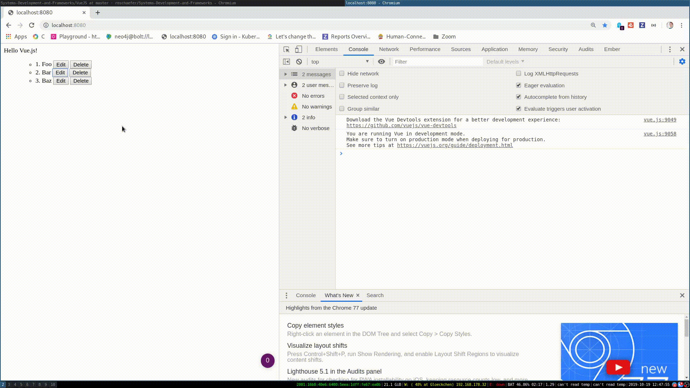

# Exercise \#1

Implement a simple todo app with VueJS.

Each item in the todo app should:

* :heavy_check_mark: Edit: display a form to update the todo
* :heavy_check_mark: Save: update the todo and display it
* :heavy_check_mark: Cancel: cancel the form submission
* :heavy_check_mark: Delete: delete the todo

Here is how the result should look like:

Use computed properties and events where possible and make use of the component
pattern.

:heavy_check_mark: Get extra praise for implementing the "Add todo" button! :heart:
